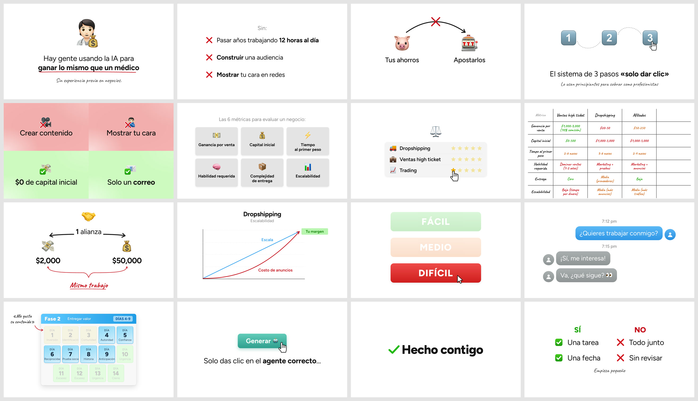
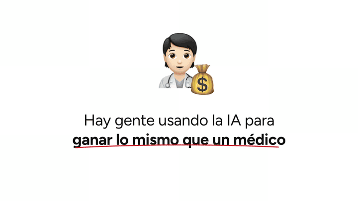

# ✏️ Diapositivas Pizarrón IA

**Skill de Claude Code** que convierte un tema, un guion o una grabación en diapositivas estilo
**pizarrón**. Llevan lienzo blanco, un emoji como ícono y una capa manuscrita roja con subrayados,
flechas, llaves y sellos. Se revelan **frase por frase**, como en los videos largos de Iman
Gadzhi.



<p align="center"></p>

## Qué hace

- **26 diseños**: idea, lista, flujo, sistema de pasos 1-2-3, bifurcación, tabla-marcador escrita
  a mano, gráficas, línea de tiempo, medidor, rejillas de cantidad, chat, capturas de prueba con
  el dato encerrado, reparto, calendario de fases, botón con cursor, lámina de oferta y más.
- **Revelado por acumulación**: cada frase suma un elemento sin mover nada. Es el ritmo de la
  referencia: un cambio visual cada 2.5 segundos.
- **Cuatro salidas**:
  1. **Presentador HTML** para clases en vivo (→ avanza, F pantalla completa).
  2. **PNG por paso** para tu editor.
  3. **Video** con micro-animaciones: el cursor hace clic, la ruta punteada se dibuja y el sello
     cae.
  4. **Montaje sincronizado sobre tu grabación a cámara**: la lámina aparece justo cuando dices
     su frase.
- **Revisión automática** con nota de 0 a 100: detecta desbordes, textos encimados, exceso de
  palabras, exceso de énfasis y falta de variedad.
- **Conocimiento destilado** del video de referencia en [`references/`](references/):
  - la biblia del estilo, con medidas;
  - el método para traducir un guion a láminas;
  - el diccionario de emojis;
  - la anatomía del video con marcas de tiempo.

## Instalación

```bash
curl -fsSL https://raw.githubusercontent.com/m4nueldeleon/diapositivas-pizarron-ia/main/install.sh | bash
```

Necesitas Node 18 o más. El instalador baja Playwright con Chromium y las tipografías libres.
Para video y montaje también necesitas `ffmpeg` (`brew install ffmpeg`).

## Uso con Claude Code

Pídele cosas como:

- «Hazme las láminas estilo pizarrón de este guion».
- «Quiero la clase del lunes sobre X con diapositivas estilo Iman».
- «Monta las láminas sobre mi video `crudo.mp4`».

Claude lee la biblia del estilo, parte tu guion en beats, elige el diseño de cada uno, escribe
`deck.json`, renderiza, **mira** el resultado, corre la revisión y te entrega el presentador, los
PNG o el video.

## Uso directo

```bash
S=~/.claude/skills/diapositivas-pizarron-ia
node $S/scripts/render.mjs mi-video      # salida/index.html + salida/laminas/*.png + salida/hoja.jpg
node $S/scripts/qa.mjs mi-video          # nota 0-100
node $S/scripts/video.mjs mi-video       # salida/laminas.mp4
node $S/scripts/video.mjs mi-video --sobre crudo.mp4 --transcripcion crudo.json   # salida/montaje.mp4
```

Un `deck.json` mínimo:

```json
{
  "marca": { "texto": "tumarca", "sufijo": ".com" },
  "laminas": [
    { "tipo": "idea", "emoji": "🧑‍⚕️+💰", "texto": "La gente la usa para\n__ganar lo mismo que un médico__",
      "nota": "Sin experiencia previa.", "voz": ["La gente la usa para ganar lo mismo que un médico", "sin experiencia previa"] },
    { "tipo": "lista", "encabezado": "Sin:", "vineta": "x", "items": ["**Mostrar** tu cara", "**Invertir** miles"] },
    { "tipo": "flujo", "nodos": [{ "emoji": "🕵️", "etiqueta": "Identificar" }, { "emoji": "🤝", "etiqueta": "Aliarte" }] }
  ]
}
```

El catálogo completo de diseños y campos está en [`references/LAYOUTS.md`](references/LAYOUTS.md).
El demo con los 26 diseños, en [`ejemplos/demo/deck.json`](ejemplos/demo/deck.json).

### Montaje sobre tu grabación

1. Transcribe con marcas por palabra. En una Mac con chip Apple:
   `uvx --python 3.12 --from mlx-whisper mlx_whisper crudo.mp4 --language es --word-timestamps True --output-format json`.
2. Escribe en cada lámina la `voz`, lo que dices en ese momento. No tiene que ser idéntica: el
   alineador tolera palabras mal reconocidas y muletillas.
3. Corre `video.mjs --sobre crudo.mp4 --transcripcion crudo.json`. Sale `montaje.mp4`, con el
   audio original, y `cortes.csv` con cada corte. Las láminas `camara` dejan ver tu grabación.

## Cómo se construyó

Se analizó cuadro por cuadro un video de 45 minutos:

- 539 cuadros en hojas de contacto y 20 láminas a resolución completa.
- Ráfagas a 8 cuadros por segundo para entender la animación.
- Medición de ritmo y muestreo de color.

Después se replicaron láminas del video con el motor y se compararon **lado a lado** para
calibrar tamaños. Esa comparación reveló que la primera versión era 1.45 veces más chica de lo
que debía. Todo está documentado en
[`references/ANATOMIA-REFERENCIA.md`](references/ANATOMIA-REFERENCIA.md). El repo **no incluye
cuadros del video**, porque son de su autor.

## Créditos y licencias

- Código: MIT © Manuel de León.
- Estilo inspirado en los videos de Iman Gadzhi y Consulting.com. Este proyecto no está
  afiliado a ellos ni usa su marca.
- Tipografías Figtree, Caveat y Zilla Slab: SIL Open Font License, incluida en `assets/fonts/`.
- Emojis:
  - en Mac se usa la fuente del sistema, Apple Color Emoji;
  - fuera de Mac, [Fluent Emoji 3D](https://github.com/microsoft/fluentui-emoji) de Microsoft,
    con licencia MIT, servidos por jsDelivr desde `@lobehub/fluent-emoji-3d`.

  Si publicas videos comerciales, `"emoji": "fluent"` usa solo emojis con licencia MIT.
